# Deep Tesla 

This project is an End-to-End behavioral cloning solution for the Deep Tesla dataset. End-to-end steering describes the driving-related AI task of producing a steering wheel value given an image.  The goal is to predict steering wheel angles from the dashcam video feed of a Tesla. The project stems from  the course [MIT 6.S094: Deep Learning for Self-Driving Cars](http://selfdrivingcars.mit.edu/) and the original github repo can be found [here](https://github.com/lexfridman/deeptesla).  All code is written in Python and uses Keras with a Tensorflow backend. The model was trained on FloydHub and the mounted dataset can be found [here](https://www.floydhub.com/mnalavadi/datasets/deeptesla/1). 

## Background: 

In my approach I test the efficacy of using Singular Value Decomposition (SVD) for image background removal and prediction with a convolutional neural network (CNN). I chose background removal because objects such as the car hood, dashboard, windsheild reflections, and a object stuck to the windsheild do not provide any predictive power to the model. The model wastes time learning these features which stay largely static from frame to frame. Background removal with SVD should help the model train faster and with perfrom better since low-rank features are disregarded from the input images. This write up outlines my research process, learnings, and takeaways. 

## Hypothesis 

Singular Value Decomposition decreases training time and loss metrics (mean squared error) when applied to dash-cam imagery for self-driving-car end-to-end behavioral modelling. 

## Dataset 

The dataset consists of 10 videos (.MKV format) of about 90 seconds each, shot at 30fps. The RGB image frames are of size 1920 x 1080 x 3. Each video is accompanied with a .CSV which contains the frame index and steering wheel angle. I split the data such that there were 7 videos for training and 3 for validation. 

## Singular Value Decomposition 

[Notebook with in depth implementation here](singular_value_decomp.ipynb). 

Singular Value Decomposition is a linear algebra technique to factorize a matrix such that you can represent it with smaller number of component vectors. This compression algorithm is commonly used for dimensionality reduction in techniques such as Principal Component Analysis. The process consists of factorizing matrix A shown below:

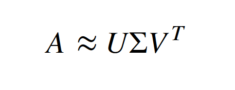

In the equation above, U and V-Transpose are othonormal matrices, and Sigma is a diagnial matrix where the magnitude of each value represents the contributing strength of that component to the approximation of A. The diagram below depicts how A can be reduced down to 'r' components. When applying SVD, r is a hyperparameter we set which determines how low of a rank we want to embed A into. Multiplying these three matrices results in an approximation of A, where noise tends to be removed. 

In the SVD notebook, I call this approximation the low rank matrix, because it is a low rank estimation of our video matrix. The video matrix consists of an entire video stream where each frame is flattened into 3 vectors (RGB) along the x axis.The y-axis is then the time progression of the video. The result is a matrix visualized below (Flattened Original Matrix).

**Aside**: I originally tried grayscaling the images, but this would require training the CNN on grayscaled images for the benchmark, and the model consistently failed with this lower fiedlity data. I went back and tweaked the SVD notebook to create RGB approximations, which were actually faster to compute than grayscale (3 SVDs per video vs. grayscaling each of ~1500 frames). 

The horizontal lines can be interpreted as pixels who's intensity remains stationary (relatively) throughout the video stream (unmoving objects) and the curves can be interpreted as movement frame-to-frame. The dark streaks along t=250, 800, are the car passing under an overpass. As we can see by the horizontal lines, there is a lot of redundancy frame-to-frame, which can be modeled by a low rank matrix. We can subtract video matrix (A) from the low rank matrix approximation of A (USV^T) to yield extract the general motion of the frame. This is the process of background removal.

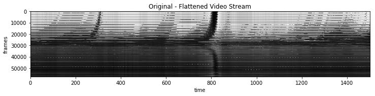

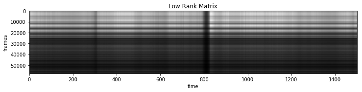

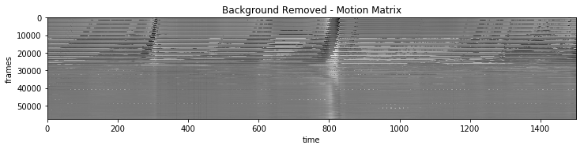

We can visualize the image results of these three matrices by extracting one vector from the matrix and reshaping it back to image format. 

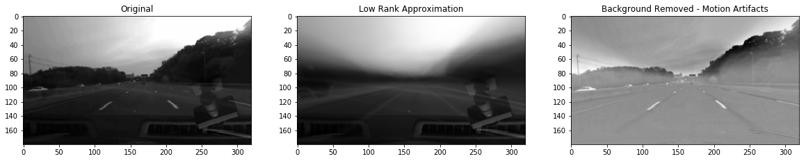

This background removal looks analgous to the output of the 1st layer of [MIT's example network](http://selfdrivingcars.mit.edu/deeptesla/), hinting that SVD could be a good preprocessing method for offloading work from training the neural network. This pipeline of low rank approximation and background removal was applied for all video streams. To generate a single image per video stream, the low rank matrix was sorted along the time axis and the median frame vector was extracted, so that it did not contain outliers of any pixel of the image frame. A single low rank image was then saved for each video stream, which will be used for image preprocessing. 

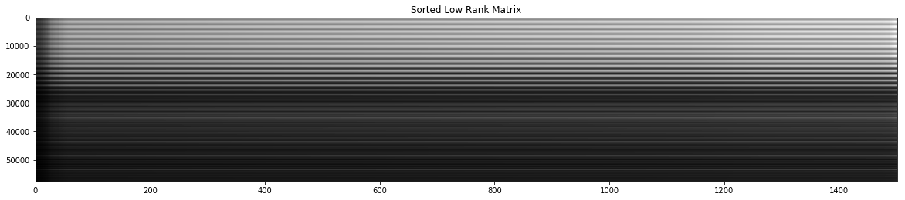

#### Data Preprocessing 

For several of the .MKV/.CSV pairs, there was a mismatch between the framecount, so I interpreted the data such that the frames were aligned starting at frame 0, and any remainder of frames that were excess were excluded from the analysis and training. The distribution of steering wheel angles for a video can be viewed below. The range of these values is [-18, 15]. **Since I know the range of what the predicted values should be, I aided the neural network with training by scaling the values and having the network predict a percentage of the steering range. The scaling function is `new_angle = (angle+20) / (2*20)`**

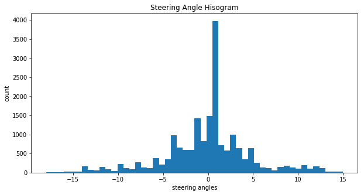

I built a [python generator](test_generator.ipynb) to process the images and yeild mini-batches. The generator performs some of the aforementioned image preprocessing: RGB-to-grayscale and background removal with the SVD low rank preprocessed image. Additionally, it normalizes the image data to a range [0, 1] by dividing by 255, and each image is resized to [180, 320]. There is an option to flip the image and steering angle as well, for data augmentation. The generator also takes into account multithreading for GPU support, and envokes a thread lock-and-release for each batch. A batch of 16 images for regular images and SVD background removed, respectively, are shown below. 

**Original** 
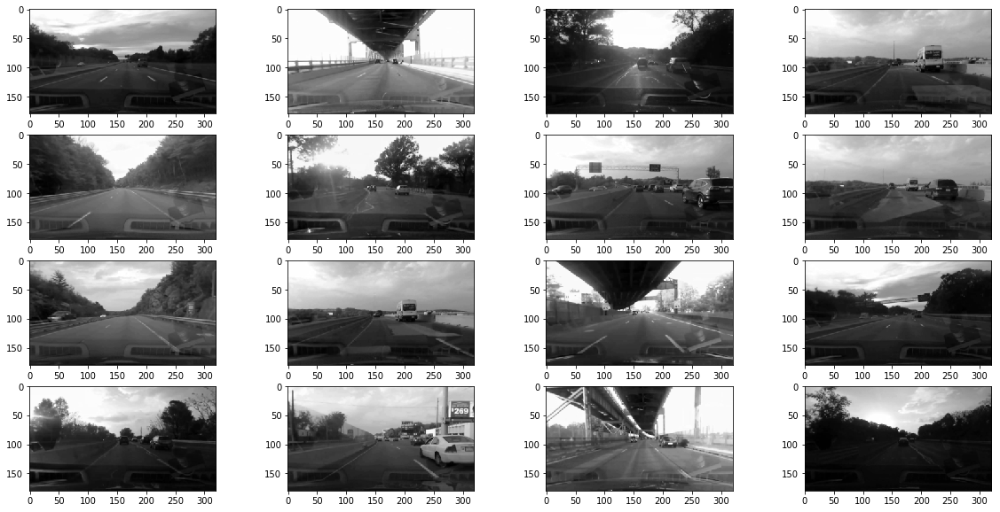

**Background Removed**
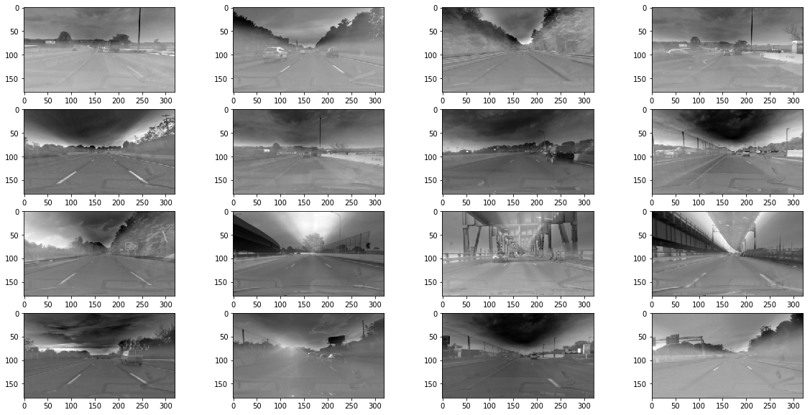

## Training 

[Notebook with training implementation here](train.ipynb)

#### Experiment Design 
My experiment was designed as follows: The dependent variable was the mean squared error validation loss, and the independent variables are applicaiton of SVD. I let all other model parameters and tuning settings the same for comparing models. 

#### Model 

The model was a convlutional neural network modeled off of [NVIDA's End-to-End Self Driving Car Paper](http://images.nvidia.com/content/tegra/automotive/images/2016/solutions/pdf/end-to-end-dl-using-px.pdf). I used strided convolutions in the first three convolutional layers with a 22 stride and a 55 kernel and a non-strided convolution
with a 33 kernel size in the last two convolutional layers. The convolutional layers each had RELU activation, L2 regularization (strength 0.1). The fully connected layers each had RELU activation and the amound of neurons per each layer was as follows [1164, 100, 50, 10, 1]. All convolutional and fully connected layers and RELU activation, except linear for the last, were trained with a dropout probability of 0.5. Each image entering the network was cropped with 60 pixels from the top, to remove the sky from the dash-cam image.   

Orginally I trained using RGB images, and not converting to YUV like NVIDIA. However, this proved to create a fllor for the validation loss (MSE) around 9.0 when training on the control (without SVD), which was still quite high. I switched to YUC color space and achieved a validation control loss 

Additionally, I did not augment the data in any way, while NVIDIA add random shifts and rotations to their training data. I elected not to do this since I could not properly reverse the random shifts to the steering wheel angle during inference. 

#### Training 

Prior to training on the entire dataset, I applied some sanity check [techniques recommended by Andrej Karpathy](https://cs231n.github.io/neural-networks-3/#gradcheck) (he is the director of AI at Tesla, after all...) and [this website](http://theorangeduck.com/page/neural-network-not-working). One important gradient check I first employed was to remove all regularizers(strength, dropout, kernel constraints, batch normalization), and tested on a small subset of 20 training images. This was to double check that the model loss would indeed converge to 0 (though overfit). 

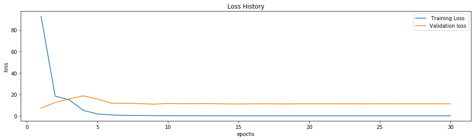

From here, I could fine tune the model architecture. As mentioned, I started with the tried and tested NVIDIA model architeceture. For training, I slowly increased the data size and monitored the loss evolution, while testing other indepenent variable hyperparameters (batch size, learning rate, regularization strength, dropout rate, model architecture) -- basically everything except SVD application.  First, I tested the model with no regularization parameters. I settled on a batch size of 256 for training speed. From here, I iteratively added the regularization parameters, and slowly strengthened their effects, so I could oberve a noticeable, but not dominant contribution from any one of them. 

At this point my model would run roughly the same if I tweaked any of the regularization hyperparamters, meaning the model was roughly agnostic to minor variations in any one of them - a good sign for generalization. Next up was to fine tune the learning rate which was arbitrarily set at the Keras Adam default of 0.001. During training on the existing model, I noticed that the validation loss would bottom out around 8.0, with minor flucuations of 0.2 in either direction, around epoch 11/20. This is roughly where the model improvement lost its 'inertia'. I considered it safe, therefore, to the lower the learning rate, allowing me to squeeze out further improvments, albeit more slowly, for the remaining 9 epochs. Halving the learn rate allowed the new bottom-out to occur at 7.3 validation loss. 

For the final models, I settled on the following parameters: 

    batch size: 256
    learning rate: 0.0005
    L2 regularization strength: None 
    dropout rate: 0.05
    number epochs: 20
  
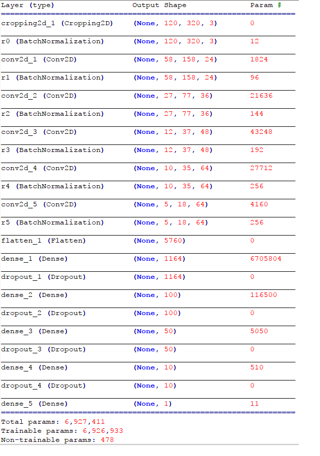
 
 
 ### Results 
 
 ### Conclusion 